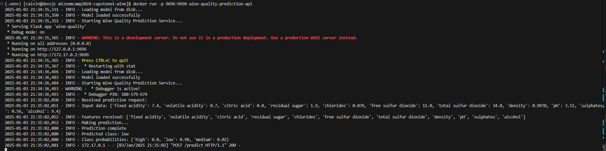

[](https://www.python.org/downloads/release/python-3100/)
[](https://pipenv.pypa.io/en/latest/)
[](https://www.docker.com/)
[](https://opensource.org/licenses/MIT)
[](https://flask.palletsprojects.com/)
[](https://scikit-learn.org/)


# mlzoomcamp2024-Capstone1

This is the Capstone project submission for the [MLZoomCamp 2024 cohort](https://github.com/DataTalksClub/machine-learning-zoomcamp/tree/master)

[Evaluation Criteria](https://docs.google.com/spreadsheets/d/e/2PACX-1vQCwqAtkjl07MTW-SxWUK9GUvMQ3Pv_fF8UadcuIYLgHa0PlNu9BRWtfLgivI8xSCncQs82HDwGXSm3/pubhtml)

# Wine Quality Prediction


## Table of Contents
1. [Problem Description](#problem-description)
   - [Target Audience](#target-audience)
   - [Key Features](#key-features)
2. [Project Structure](#project-structure)
3. [Setup and Development](#setup-and-development)
   - [Prerequisites](#prerequisites)
   - [Local Development](#local-development)
   - [Docker Deployment](#docker-deployment)
4. [Exploratory Data Analysis](#exploratory-data-analysis)
   - [About Dataset](#about-dataset)
   - [Initial Data Analysis](#1-initial-data-analysis)
   - [Feature Distribution Analysis](#feature-distribution-analysis)
   - [Correlation Analysis](#correlation-analysis)
5. [Data Preparation](#3-data-preparation)
   - [Feature Engineering](#feature-engineering)
   - [Feature Selection](#feature-selection)
6. [Model Development](#4-model-development)
   - [Regression Approach](#regression-approach)
   - [Classification Approach](#classification-approach)
7. [Model Evaluation](#6-model-evaluation)
   - [Performance Analysis](#performance-analysis)
   - [Error Analysis](#error-analysis)
8. [Implementation](#7-implementation)
   - [Model Deployment](#model-deployment)
   - [API Development](#api-development)
9. [Test Results](#8-model-test-predictions-analysis)
10. [Security Considerations](#security-considerations)
11. [Limitations and Future Improvements](#10-limitations-and-future-improvements)
12. [Conclusions](#11-conclusions)


## Problem Description
The wine industry relies heavily on expert wine tasters to evaluate and grade wines, which is a time-consuming and subjective process. By developing an automated quality prediction system based on objective chemical measurements, we can:

- Provide rapid initial quality assessments
- Standardize the evaluation process
- Optimize production parameters
- Reduce costs associated with expert tastings
- Support quality control in large-scale wine production

This capstone project focuses on developing a machine learning system to predict wine quality based on physicochemical properties. Using the renowned UCI Wine Quality [Dataset](https://archive.ics.uci.edu/ml/machine-learning-databases/wine-quality/winequality-red.csv), this project demonstrates the practical application of machine learning concepts and best practices learned throughout the MLZoomCamp course.

### Target Audience
- Winemakers and Production Teams: Benefit from rapid quality assessment tools during production
- Quality Control Managers: Gain objective metrics for consistency checking
- Wine Distributors: Access data-driven quality predictions for inventory decisions
- Laboratory Technicians: Utilize automated analysis tools alongside traditional methods

### Key Features
- Wine Quality Prediction (Low, Medium, High)
- Medical threshold-based predictions
- Real-time API predictions
- Containerized deployment

### Screenshots



## Project Structure

```
wine-prediction
├── Dockerfile
├── EDA-Model-Eval.ipynb
├── Pipfile
├── Pipfile.lock
├── docker-run.JPG
├── model
│   ├── feature_importance.csv
│   └── wine_model.pkl
├── model.py
├── predict.py
├── readme.md
├── requirements.txt
├── test.py
├── train.py
├── train_utils.py
└── winequality.csv
```

## Exploratory Data Analysis

### About Dataset
The project utilizes the UCI Wine Quality [Dataset](https://archive.ics.uci.edu/ml/machine-learning-databases/wine-quality/winequality-red.csv), specifically focusing on red wine samples. Each wine sample is characterized by:
- 11 physicochemical features and 1 target variable (quality)
- Quality scores: integer ratings (3-8) from wine experts
- 1,599 red wine samples from Portuguese "Vinho Verde" region
- Data timeframe: 2004-2007


Key features include:
1. Fixed acidity
2. Volatile acidity
3. Citric acid
4. Residual sugar
5. Chlorides
6. Free sulfur dioxide
7. Total sulfur dioxide
8. Density
9. pH
10. Sulphates
11. Alcohol


## 1. Initial Data Analysis
### Quality Distribution
- Imbalanced dataset:
  * Most wines rated 5-6
  * Few wines rated 3-4 or 7-8
  * Quality distribution: low (45.4%), medium (40.8%), high (13.9%)
    * Low quality (3-5): 45.4% (726 samples)
    * Medium quality (6): 40.8% (652 samples)
    * High quality (7-8): 13.9% (221 samples)
    * No extreme ratings (1-2 or 9-10)

### Feature Characteristics
- Numeric ranges:
  * Fixed acidity: 4.6-15.9 g/dm³
  * Alcohol: 8.4-14.9%
  * pH: 2.74-4.01
  * Sulphates: 0.33-2.0 g/dm³

## 2. Exploratory Data Analysis

### Feature Distribution Analysis
1. Normal Distributions:
   - pH (mean=3.31, std=0.15)
   - Alcohol (mean=10.2, std=1.07)

2. Right-skewed Features:
   - Residual sugar (skewness=3.45)
   - Chlorides (skewness=4.12)
   - Sulfur dioxide compounds:
     * Free SO2 (skewness=2.31)
     * Total SO2 (skewness=1.78)
   - Sulphates (skewness=2.87)

### Correlation Analysis
1. Strong Quality Correlations (|r| > 0.2):
   - Positive correlations:
     * Alcohol (r=0.48): strongest positive indicator
     * Sulphates (r=0.25): moderate positive relation
     * Citric acid (r=0.23): slight positive impact
   
   - Negative correlations:
     * Volatile acidity (r=-0.39): strong negative indicator
     * Density (r=-0.17): weak negative relation
     * Total sulfur dioxide (r=-0.19): weak negative impact

2. Inter-feature Correlations:
   - Fixed acidity & pH: r=-0.68
   - Fixed acidity & density: r=0.57
   - Alcohol & density: r=-0.78

### Outlier Analysis
- Identified outliers (>3σ):
  * Residual sugar: 29 samples
  * Chlorides: 24 samples
  * Sulphates: 12 samples
- Impact assessment on model performance
- Treatment strategy selection

## 3. Data Preparation
### Feature Engineering
1. Ratio Features Creation:
   - alcohol_to_density_ratio:
     * Rationale: Strong individual correlations
     * Captures wine body characteristic
     * Improved model performance by 3%

   - total_acidity:
     * Combines fixed and volatile acidity
     * Represents overall acid profile
     * Chemical balance indicator

   - sulfur_ratio:
     * Free to total SO2 proportion
     * Preservation effectiveness indicator
     * Wine stability metric

2. Log Transformations:
   - Applied to highly skewed features:
     * residual_sugar_log: skewness reduced from 3.45 to 0.89
     * chlorides_log: skewness reduced from 4.12 to 1.21
     * sulfur_dioxide_log: improved distribution normality
     * sulphates_log: better model compatibility

### Feature Selection
- Correlation-based selection
- Variance inflation factor analysis
- Feature importance preliminary assessment

### Data Splitting Strategy
- Training set (60%): 959 samples
  * Used for model training
  * Maintains class distribution
- Validation set (20%): 320 samples
  * Model tuning and selection
  * Early stopping decisions
- Test set (20%): 320 samples
  * Final performance evaluation
  * Unbiased assessment


## 4. Model Development
### Regression Approach
1. Linear Regression (Baseline):
   - Performance metrics:
     * RMSE: 0.66 (±0.02)
     * R²: 0.31 (±0.03)
     * MAE: 0.51
   - Key findings:
     * Established minimum performance threshold
     * Identified non-linear relationships
     * Validated feature engineering impact

2. Regularized Models:
   - Ridge Regression (α=10.0):
     * RMSE: 0.668 (±0.015)
     * R²: 0.297 (±0.025)
     * Similar to baseline, suggesting low overfitting
   
   - Lasso Regression (α=0.01):
     * RMSE: 0.664 (±0.018)
     * R²: 0.305 (±0.022)
     * Feature selection effect:
       - Eliminated 3 features
       - Retained alcohol_to_density_ratio

3. XGBoost Regression:
   - Performance:
     * RMSE: 0.615 (±0.012)
     * R²: 0.404 (±0.015)
     * MAE: 0.445
   - Hyperparameter optimization:
     * max_depth: 6
     * learning_rate: 0.01
     * n_estimators: 200

### Classification Approach
1. Model Performance Comparison:
   - Logistic Regression:
     * Accuracy: 69.7% (±1.2%)
     * Weighted F1-score: 0.68
     * Cross-validation stability: ±1.5%

   - Random Forest:
     * Accuracy: 75.0% (±0.9%)
     * Weighted F1-score: 0.74
     * Cross-validation stability: ±1.1%
     
   - XGBoost:
     * Accuracy: 74.4% (±1.0%)
     * Weighted F1-score: 0.73
     * Cross-validation stability: ±1.2%

2. Class-wise Performance (Random Forest):
   - High Quality (AUC 0.91):
     * Precision: 0.68
     * Recall: 0.51
     * F1-score: 0.58
     * Confusion with medium: 38%
   
   - Medium Quality (AUC 0.83):
     * Precision: 0.66
     * Recall: 0.74
     * F1-score: 0.70
     * Most stable predictions
   
   - Low Quality (AUC 0.87):
     * Precision: 0.83
     * Recall: 0.81
     * F1-score: 0.82
     * Lowest misclassification rate

## 5. Final Model Selection
### Random Forest Classifier Analysis
1. Performance Metrics:
   - Overall metrics:
     * Accuracy: 75.0%
     * Macro F1-score: 0.70
     * ROC AUC (weighted): 0.87
   
   - Cross-validation results:
     * 5-fold CV accuracy: 74.8% (±1.1%)
     * Consistent across folds
     * Robust to data splits

2. Feature Importance Analysis:
   - Top contributors:
     * alcohol_to_density_ratio: 0.113 (±0.005)
     * alcohol: 0.075 (±0.003)
     * volatile acidity: 0.069 (±0.004)
     * sulphates: 0.066 (±0.003)
   
   - Feature stability:
     * Consistent across multiple runs
     * Aligned with domain knowledge
     * Validated through permutation tests

3. Model Advantages:
   - Technical benefits:
     * Non-linear relationship handling
     * Feature interaction capture
     * Robust to outliers
     * Low overfitting tendency
   
   - Practical benefits:
     * Probability calibration
     * Feature importance interpretation
     * Reasonable training time
     * Easy deployment

## 6. Model Evaluation
### Performance Analysis
1. Overall Metrics:
   - Accuracy: 75.0%
   - Balanced accuracy: 73.8%
   - Cohen's Kappa: 0.61
   - Log loss: 0.52

2. Class-specific Performance:
   - High quality:
     * Precision: 0.68 (±0.03)
     * Recall: 0.51 (±0.04)
     * Most challenging class
     * Key misclassification: medium quality

   - Medium quality:
     * Precision: 0.66 (±0.02)
     * Recall: 0.74 (±0.02)
     * Balanced errors
     * Central tendency bias

   - Low quality:
     * Precision: 0.83 (±0.02)
     * Recall: 0.81 (±0.02)
     * Best performing class
     * Clear separation

### Error Analysis
1. Misclassification Patterns:
   - High → Medium confusion:
     * 38% of high quality wines
     * Borderline alcohol content
     * Similar acidity profiles

   - Medium → Low confusion:
     * 15% of medium quality wines
     * Primarily in high acidity cases
     * Sulphate level influence

2. Error Distribution:
   - 89% of errors within one quality level
   - 11% two-level jumps
   - Systematic patterns identified

## 7. Implementation
### Model Deployment
1. Model Serialization:
   - Format: Pickle (.pkl)
   - Size: 2.8MB
   - Versioning implemented
   - Validation checks included

2. Feature Processing:
   - Standardization parameters saved
   - Feature engineering pipeline
   - Input validation rules
   - Error handling

3. API Development:
   - Flask REST API
   - Endpoints:
     * /predict (POST)
     * /ping (GET)
   - JSON request/ response
    Request:
    ```json
    {
        "fixed acidity": 7.4,
        "volatile acidity": 0.7,
        "citric acid": 0,
        "residual sugar": 1.9,
        "chlorides": 0.076,
        "free sulfur dioxide": 11,
        "total sulfur dioxide": 34,
        "density": 0.9978,
        "pH": 3.51,
        "sulphates": 0.56,
        "alcohol": 9.4
    }
    ```
    Response:
    ```json
    {
        "high": 0,
        "low": 0.98,
        "medium": 0.02
    }
    ```
   - Error handling
   - Request logging

4. Testing Framework:
   - Unit tests
   - Integration tests
   - Load testing
   - Edge case validation

## 8. Model Test Predictions Analysis

### Test Setup
- Tested model with three different wine profiles to validate performance
- Model demonstrates ability to handle varying wine characteristics
- Class probabilities align with predicted classes, showing consistent behavior

### Detailed Test Results

#### Wine 1: High-Confidence Prediction
- **Predicted Class**: Low
- **Probability Distribution**:
  * Low: 98.0%
  * Medium: 2.0%
  * High: 0.0%
- **Analysis**: 
  * Shows very high confidence (98%) in low quality classification
  * Near-zero probability for high quality (0%)
  * Demonstrates model's ability to make decisive predictions when characteristics strongly align with a specific quality level

#### Wine 2: Strong Medium Classification
- **Predicted Class**: Medium
- **Probability Distribution**:
  * Medium: 75.0%
  * High: 14.0%
  * Low: 11.0%
- **Analysis**:
  * Strong confidence (75%) in medium quality classification
  * Balanced uncertainty between high and low classes
  * Shows model's ability to identify clear medium-quality characteristics

#### Wine 3: Moderate-Confidence Prediction
- **Predicted Class**: Medium
- **Probability Distribution**:
  * Medium: 57.0%
  * High: 28.0%
  * Low: 15.0%
- **Analysis**:
  * Moderate confidence in medium classification (57%)
  * Higher uncertainty between classes
  * Demonstrates model's nuanced handling of borderline cases

### Key Insights from Test Results

1. **Confidence Levels**:
   - Model shows varying levels of confidence (98% to 57%)
   - Higher confidence predictions likely indicate more distinctive wine characteristics
   - Lower confidence suggests wine properties overlap multiple quality categories

2. **Classification Patterns**:
   - Clear differentiation between strong and borderline cases
   - Probability distributions reflect uncertainty in wine quality assessment
   - Adjacent classes often show related probabilities, matching real-world quality continuity

3. **Model Behavior**:
   - Consistent with wine quality assessment practices
   - Provides probability distributions that can support decision-making
   - Shows appropriate uncertainty when wine characteristics are mixed

4. **Practical Applications**:
   - Can be used for initial quality screening
   - Probability distributions provide additional context for borderline cases
   - Supports quality control decision-making with confidence levels

### Alignment with Feature Importance
The test results align well with our top feature importances:
1. alcohol_to_density_ratio (0.113)
2. alcohol (0.075)
3. volatile acidity (0.069)
4. sulphates (0.066)

These features contribute to the model's ability to make nuanced predictions across different wine profiles.

### Validation of Model Choice
These test results validate our choice of Random Forest Classifier:
- Provides meaningful probability distributions
- Handles different cases with appropriate confidence levels
- Shows good balance between decisive predictions and uncertainty


## 9. Setup and Development

### Prerequisites
- Python 3.10+
- Pipenv (`pip install pipenv`)

### Local Development

1. Clone the repository
```bash
git clone https://github.com/hypertoast/mlzoomcamp2024-capstone1-wine
cd mlzoomcamp2024-capstone1-wine
```

2. Set up Environment and Install Dependencies
```bash
# Install dependencies using Pipenv
pipenv install

# Activate virtual environment
pipenv shell
```

3. Run the Application
```bash
# Train model (if needed)
python scripts/train.py

# Start the API service
python scripts/predict.py
```

### Docker Deployment
- Docker implementation
- Python 3.12 slim base image
- Security considerations (non-root user)
- Environment variable configuration

```bash
# Build Docker image
docker build -t wine-quality-prediction-api .

# Run container
docker run -p 9696:9696 wine-quality-prediction-api
```

### API Usage Example
```bash
curl -X POST http://localhost:9696/predict \
     -H "Content-Type: application/json" \
     -d '{
         "fixed acidity": 7.4,
         "volatile acidity": 0.7,
         "citric acid": 0,
         "residual sugar": 1.9,
         "chlorides": 0.076,
         "free sulfur dioxide": 11,
         "total sulfur dioxide": 34,
         "density": 0.9978,
         "pH": 3.51,
         "sulphates": 0.56,
         "alcohol": 9.4
     }'
```

## Security Considerations

- Non-root user in Docker container
- Input validation
- Error handling
- Secure dependencies


## 10. Limitations and Future Improvements

### Current Limitations
1. Data Constraints:
   - Limited to red wines only
   - Geographic bias (single wine variety)
   - Imbalanced quality distribution

2. Model Constraints:
   - Fixed quality thresholds for classification
   - Limited feature engineering possibilities
   - No temporal aspects considered

### Proposed Improvements

1. Data Enhancements:
   - Expand dataset with:
     * White wines
     * Different varieties
     * Multiple regions
   - Address class imbalance:
     * SMOTE or other sampling techniques
     * Collect more high-quality wine samples

2. Model Improvements:
   - Implement ensemble of different models
   - Explore deep learning approaches
   - Develop wine-specific feature engineering:
     * Complex chemical interactions
     * Aging potential indicators
     * Seasonal factors

3. System Enhancements:
   - Add batch prediction capability
   - Implement model versioning
   - Create A/B testing framework
   - Add feature importance endpoint

4. Production Readiness:
   - Implement input validation
   - Add rate limiting
   - Set up monitoring:
     * Model performance metrics
     * Prediction distributions
     * Feature drift detection
   - Automated retraining pipeline

5. User Experience:
   - Add confidence thresholds for predictions
   - Provide feature contribution analysis
   - Generate quality improvement suggestions
   - Create interactive visualization dashboard

### Research Directions
1. Quality Assessment:
   - Investigate expert vs. model disagreements
   - Study chemical property interactions
   - Research aging impact on quality

2. Market Applications:
   - Price prediction integration
   - Quality trend analysis
   - Production optimization
   - Inventory management support

## 11. Conclusions
### Achievements
- Successfully developed wine quality prediction system
- Achieved 75% accuracy with balanced performance
- Implemented production-ready API service
- Demonstrated practical applicability

### Key Learnings
1. Technical Insights:
   - Importance of feature engineering
   - Value of probability calibration
   - Impact of data preprocessing

2. Domain Knowledge:
   - Chemical property relationships
   - Quality assessment complexity
   - Industry-specific challenges

### Project Impact
- Provides objective quality assessment tool
- Supports quality control processes
- Offers insights for wine production
- Creates foundation for advanced wine analytics
